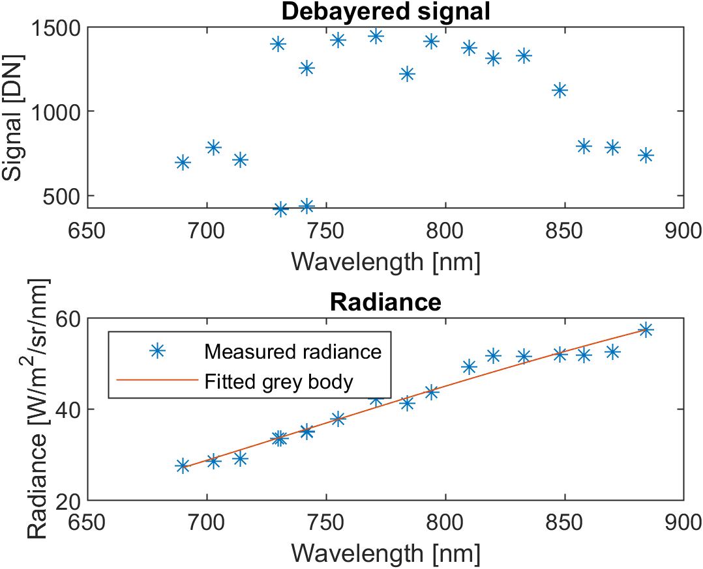

# mosaic-temp MATLAB package
Hyperspectral Temperature Estimation with Mosaic Camera

Author: Charles Snyers

## Overview

This repository contains a MATLAB implementation of multicolour pyrometry method with grey body hypothesis to estimate temperature from hyperspectral data.

$$ \hat T = \arg \min_T\sum^N_{i=1} \left | \frac{L_{\lambda,i}}{L_{\lambda,n}} - \frac{B(\lambda_i,T)}{B(\lambda_n,T)} \right |^2$$

 

The calibration used in this repository was measured on the MiCLAD machine located at the VUB (Brussels, Belgium) with the 3D-One Avior camera. This code was developed in the context of the following doctoral thesis: 

Snyers, Charles. *Machine Learning-Based Process Optimization Using Hyperspectral Imaging in Directed Energy Deposition.* Vrije Universiteit Brussel, 2024. https://researchportal.vub.be/en/publications/machine-learning-based-process-optimization-using-hyperspectral-i

## Usage

The code uses the following structure (see `main.m` for examples):

    raw_frames = readImages(filename, bitlength); % reads raw HS images
    clipped_frames = clipFrames(raw_frames); % removes uncomplete macropixels
    deb_frames = debayer(clipped_frames);
    [i_wl, L, T, emissivity, err] = fitTemp(deb_frames, exposure, bitlength, head);

## How to Cite

If you use this software, please cite:

1. The software: 

2. The accompanying PhD thesis: Snyers, Charles. *Machine Learning-Based Process Optimization Using Hyperspectral Imaging in Directed Energy Deposition.* Vrije Universiteit Brussel, 2024. https://researchportal.vub.be/en/publications/machine-learning-based-process-optimization-using-hyperspectral-i

## License

This project is licensed under the [MIT License](LICENSE).